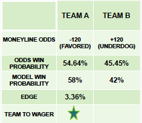

# MLB Moneyline Odds Betting Model

In May 2018, the Supreme Court struck down a federal ban on sports betting  paving the way for states
to draft their own sports betting legislation as desired. Several states have already passed sports gabmling legislation with several more having legislation currently being ironed out.  Being interested in all types of markets, I wanted to explore the betting market as it gains widespread legitimacy.

## Concept

 

The above is a chart explaining the mechanics of this project. Using historical odds for the 2014, 2015, 2016, and 2017 season, my goal was to develop 
a model to see if the odds accurately reflect the win probability of a certain team winning a game. My model produces a win probability that when compared to the implied probability derived from the market betting odds could potentially detect an edge in the favor of a bettor.  By identifying and wagering on games with a positive edge, the goal was to have a positive Return on Investment (ROI) for a full season.

## The Dataset
The dataset used for this project was a complete list of all games for the years 2014-2017\*.  The games were then filtered for only those games where this specific strategy applies.  The original tables were approximately 19,000 rows, which were one
row per team per game.  The rows were split and then merged on the game_id column so that each row represented one game.  The final total row count for analyzed for the purpose of this study was approximately 9500 rows. I then used scraped baseball statistics from baseball-reference.com for the corresponding seasons and games for each team to develop the features within the model.

## Methods

Both a Logistic Regression and Random Forest Classifier via sklearn were explored in this project. My train set was the 2014, 2015, 2016 seasons.  The holdout set was the 2017 season. Features of the model were three-game rolling averages of team hitting statistics for each team combined with the Visitor and Home Team Runlines from the odds dataset.

## Results
Preliminary results indicate that the model was profitable in 2017; however, further testing is in progress to fully determine the profitability. The future challenge is bringing the model 'real-time' so that a bettor could use the model in making wagers on a current season. While getting the updated statistics would simply involve re-running the scraper, getting the odds data fast enough to make a prediction and exploit an edge may prove challenging. Additionally, more stratified data could potentially be implemented to improve predictions within the model. Some examples: Matchup data, Umpire Stats, Starting Pitching, more thorough testing of optimal rolling average window sizes.

### References 
* https://www.sportsbookreviewsonline.com/scoresoddsarchives/mlb/mlboddsarchives.htm
* https://www.baseball-reference.com

